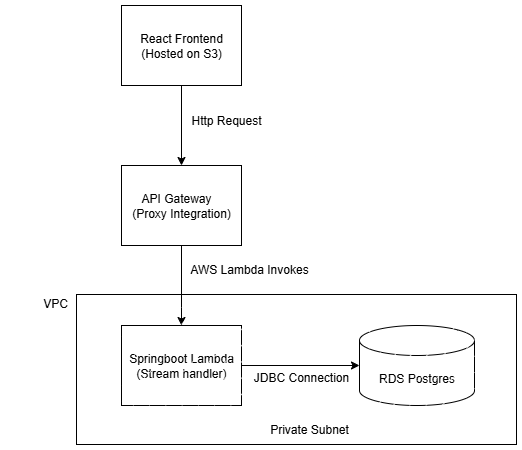

# StudentCrudAwsRds

## Overview
**StudentCrudAwsRds** is a Java Spring Boot backend project that provides CRUD (Create, Read, Update, Delete) operations for managing student records. 

The backend is deployed on **AWS Lambda** using **Spring Cloud Function** and is connected to an **AWS RDS PostgreSQL** database. The API is exposed via **AWS API Gateway**, which resides in a **VPC** with properly configured subnets for secure networking. **IAM roles** are used to control access to AWS resources. The frontend is hosted on **AWS S3** as a static website.

[This is the frontend repo] (https://github.com/algobrewery/student-aws-rds-demo-frontend/)

**Working frontend link:**  
[Student CRUD Demo](http://student-crud-demo-frontend.s3-website-ap-southeast-2.amazonaws.com/)

---

## Features
- Create, Read, Update, and Delete student records
- Serverless backend using AWS Lambda
- REST API exposed via API Gateway
- Secure network setup in VPC with private/public subnets
- Persistent data storage in PostgreSQL (RDS)
- IAM roles for controlled AWS access
- Frontend hosted on S3
- Easy CI/CD integration with GitHub

---

## Architecture Overview

## Prerequisites
- Java JDK 21
- Maven
- Git
- AWS Account with Lambda, RDS, API Gateway, S3 access, and IAM permissions

---

## Setup Instructions

### 1. Clone the repository
//bash
git clone https://github.com/algobrewery/student-aws-rds-demo.git
cd student-aws-rds-demo

2. Configure database
Update your application.properties (or use environment variables) with your RDS PostgreSQL credentials:

3. Build and deploy to AWS Lambda
//bash
mvn clean package
Upload the generated JAR to AWS Lambda, assign the appropriate IAM role, and configure environment variablesand set up rds postgres database. Ensure Lambda is associated with the correct VPC and subnets.

4. Configure API Gateway
Create REST API and integrate with Lambda

Enable CORS if frontend requests are cross-origin

Deploy API to a stage

5. Access the frontend
Open the hosted S3 link:
[Student CRUD Demo](http://student-crud-demo-frontend.s3-website-ap-southeast-2.amazonaws.com/)

#github CI/CD
//this is a demo pipeline and can be added to the repo root as .github/workflows/deploy-backend.yml 

name: Deploy Backend to AWS Lambda

on:
  push:
    branches:
      - main

jobs:
  deploy:
    runs-on: ubuntu-latest

    steps:
      # Step 1: Checkout code
      - name: Checkout code
        uses: actions/checkout@v3

      # Step 2: Set up Java 21
      - name: Set up JDK 21
        uses: actions/setup-java@v3
        with:
          java-version: '21'
          distribution: 'temurin'

      # Step 3: Build with Maven
      - name: Build JAR
        run: mvn clean package -DskipTests

      # Step 4: Zip the JAR for Lambda
      - name: Create Lambda ZIP
        run: |
          mkdir lambda_package
          cp target/*.jar lambda_package/
          cd lambda_package
          zip -r ../lambda.zip .

      # Step 5: Deploy to AWS Lambda
      - name: Deploy to Lambda
        uses: aws-actions/aws-cli@v2
        with:
          aws-access-key-id: ${{ secrets.AWS_ACCESS_KEY_ID }}
          aws-secret-access-key: ${{ secrets.AWS_SECRET_ACCESS_KEY }}
          aws-region: ap-southeast-2
          args: lambda update-function-code --function-name studentCrud --zip-file fileb://lambda.zip

